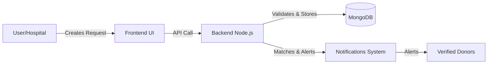

# 🩸 LifelineXK — Build. Automate. Analyze. Ship.

<p align="center">
  <b>Connecting Heroes. Saving Lives.</b><br><br>
  
</p>

---

## ✨ Overview

LifelineXK is a premium, full-stack Blood Donor Management System designed to bridge the gap between blood donors and recipients in critical times. Built with a modern tech stack, it provides a seamless, secure, and intuitive platform for hospitals, donors, and administrators. 

Whether it's an emergency blood request, finding verified donors nearby, or managing hospital inventories, LifelineXK automates the workflow to ensure timely action when it matters most.

---

## 🎯 Problem Statement

Finding the right blood type during emergencies is often chaotic and time-consuming. Traditional systems rely on scattered contacts, unverified donor lists, and manual coordination, leading to critical delays that can cost lives. 

---

## 💡 Solution

LifelineXK solves this by creating a centralized, real-time platform. It uses location-based filtering, automated notifications, and an emergency request board to instantly match patients with nearby eligible donors. With built-in verification and a gamified reward system, it encourages a reliable and active community of lifesavers.

---

## 🚀 Key Features

- 🔐 **Authentication & Security:** JWT-based secure login, role-based access, and automated session management.
- 🔎 **Smart Donor Matching:** Advanced live search and filtering by state, district, city, blood group, and availability.
- ⚡ **Emergency Response:** Dedicated emergency request board with urgent alerts and nearby donor suggestions.
- 📱 **Premium UI/UX:** Fully responsive, accessible, and animated interface inspired by Apple & Linear design systems.
- 🤖 **Admin Dashboard:** Comprehensive analytics, user management, and broadcast notifications.
- 📊 **Gamification:** Reward points, achievement badges, and a public leaderboard to encourage regular donations.

---

## 🧠 How It Works



---

## 🛠️ Tech Stack

| Category | Technology |
|---|---|
| **Frontend** | React 19, Vite 8, React Router 7 |
| **Backend** | Node.js, Express 5 |
| **Database** | MongoDB (Mongoose 9) |
| **Language** | JavaScript (ES6+) |
| **Styling** | Tailwind CSS v4, Framer Motion, Lucide React |
| **Storage** | Firebase Storage |
| **Deployment** | Firebase Hosting (Frontend), Node Hosts (Backend) |

---

## 📂 Project Structure

- `client/` - React frontend powered by Vite
- `server/` - Node.js/Express backend API
- `firebase.json` - Firebase Hosting configuration
- `.env.example` - Environment variable templates

---

## ⚙️ Installation

1. **Clone the repository:**
   ```bash
   git clone https://github.com/kirankumarreddy333/LifelineXK.git
   cd LifelineXK
   ```

2. **Install Backend Dependencies:**
   ```bash
   cd server
   npm install
   ```

3. **Install Frontend Dependencies:**
   ```bash
   cd ../client
   npm install
   ```

---

## 🔑 Environment Variables

> [!CAUTION]
> Never commit `.env` files or real credentials to GitHub.

You must configure your own environment variables to run this project. Copy the `.env.example` files and replace the placeholders.

**Backend (`server/.env`):**
```env
MONGO_URI=your_database_url_here
JWT_SECRET=your_jwt_secret_here
CLIENT_URL=http://localhost:5173
```

**Frontend (`client/.env`):**
```env
VITE_API_URL=http://localhost:5000/api
VITE_FIREBASE_API_KEY=your_firebase_api_key
# See client/.env.example for other Firebase vars
```

---

## ▶️ Running the Project

Start the application locally using two terminal tabs:

**Tab 1: Backend**
```bash
cd server
npm run dev
```

**Tab 2: Frontend**
```bash
cd client
npm run dev
```

The application will be accessible at `http://localhost:5173`.

---

## 🔒 Security

- Secrets are securely managed using environment variables.
- All `.env` files are ignored via `.gitignore`.
- Credentials must never be committed; users must configure their own local environments.
- Passwords are encrypted via `bcryptjs` before storage.

---

## 🔮 Future Improvements

- Add WebSocket support for real-time live chat between donors and hospitals.
- Integrate Google Maps API for visual proximity tracking of donors.
- Implement automated SMS alerts for emergency requests.

---

## 🤝 Contributing

Contributions are always welcome! Feel free to open an issue or submit a pull request if you have ideas on how to improve the project.

---

## 👨‍💻 Author

**Kiran Velicharla**
- GitHub: [@kirankumarreddy333](https://github.com/kirankumarreddy333)

---

## 📜 License

This project is licensed under the MIT License.
See the [LICENSE](LICENSE) file for details.
